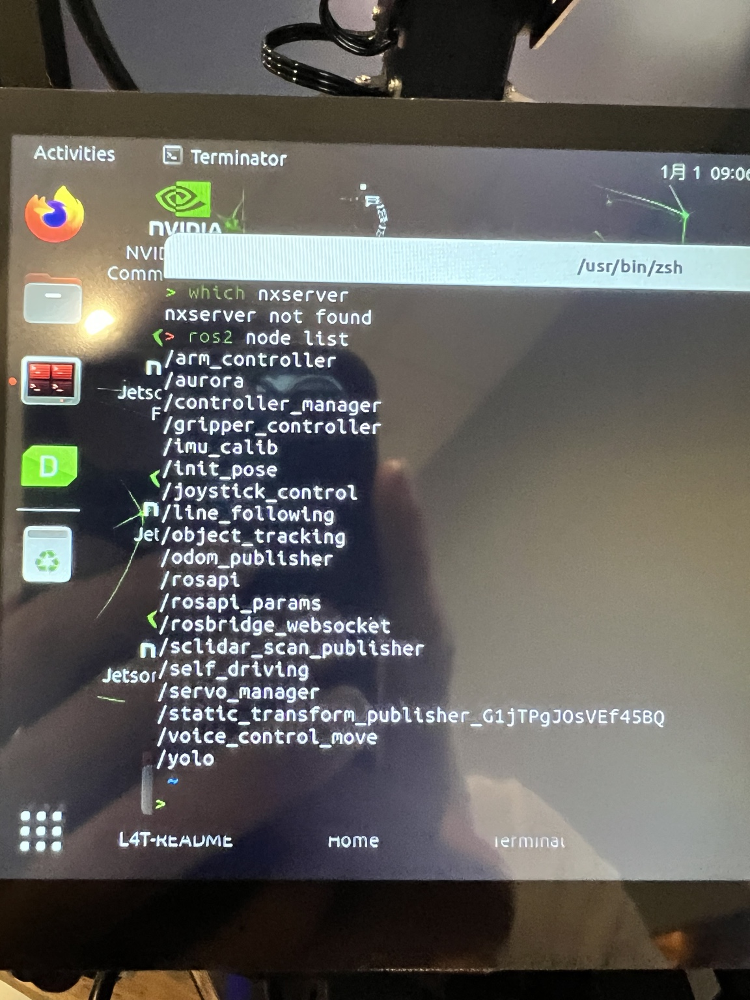
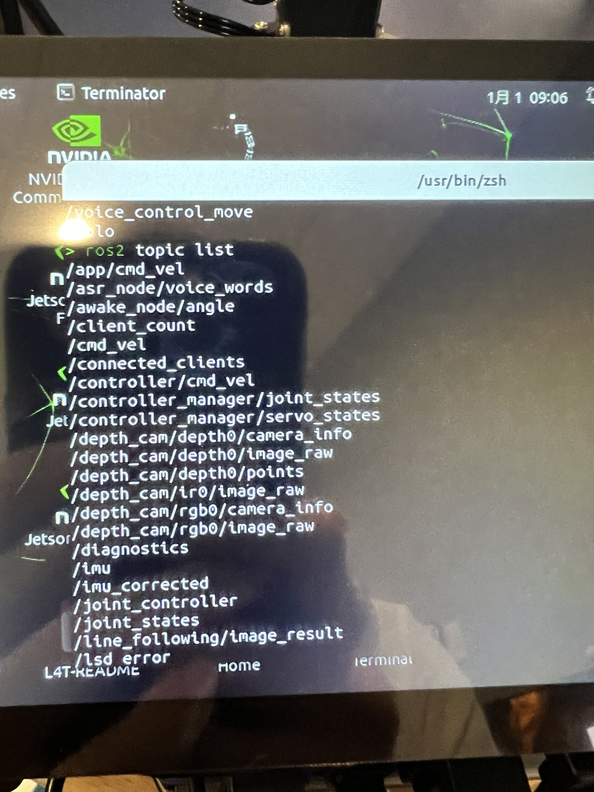
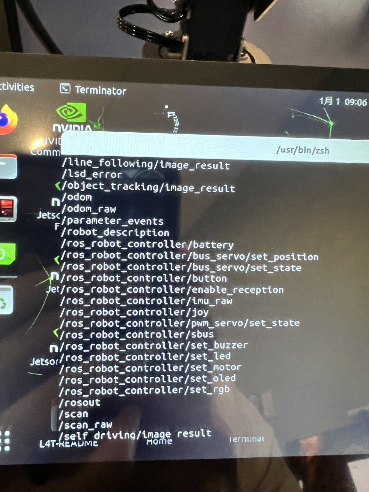
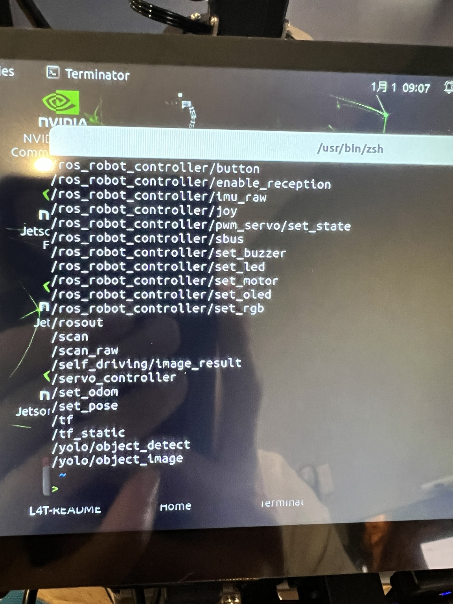

# ROSOrin Pro Feature Exploration

This repository documents the ROS 2 features currently exposed by my **Hiwonder ROSOrin Pro Mecanum robot**.

The goal is to use this as a starting point for experimenting with the robot directly through ROS 2 instead of only through the Hiwonder app.

## Robot Capabilities

### 1. Mobile Base Control

Relevant topics:

```text
/cmd_vel
/app/cmd_vel
/controller/cmd_vel
```

What this enables:

- Drive forward and backward
- Turn left and right
- Strafe left and right with the Mecanum base
- Build custom autonomous driving behaviors

Relevant nodes:

```text
/arc_controller
/self_driving
/joystick_control
```

---

### 2. Odometry and Motion Tracking

Relevant topics:

```text
/odom
/odom_raw
/set_odom
/set_pose
```

What this enables:

- Track the robot's estimated position
- Track linear and angular movement
- Support navigation and mapping
- Synchronize the real robot with a digital twin

Relevant node:

```text
/odom_publisher
```

---

### 3. LiDAR

Relevant topics:

```text
/scan
/scan_raw
```

What this enables:

- Measure obstacle distances around the robot
- Visualize nearby geometry
- Obstacle avoidance
- SLAM and mapping
- Autonomous navigation

Relevant node:

```text
/sclidar_scan_publisher
```

---

### 4. RGB Camera

Relevant topic:

```text
/depth_cam/rgb/image_raw
```

Additional camera information:

```text
/depth_cam/rgb/camera_info
```

What this enables:

- Live color camera feed
- Computer vision
- Object detection
- Object tracking
- Line following

---

### 5. Depth Camera

Relevant topics:

```text
/depth_cam/depth0/image_raw
/depth_cam/depth0/camera_info
```

What this enables:

- Estimate distance for camera pixels
- Measure object distance
- Support 3D localization
- Improve grasping and obstacle understanding

---

### 6. 3D Point Cloud

Relevant topic:

```text
/depth_cam/depth0/points
```

What this enables:

- Represent the visible environment as 3D points
- Locate objects in 3D space
- Support grasping
- Scene reconstruction
- Spatial perception

---

### 7. YOLO Object Detection

Relevant topics:

```text
/yolo/object_detect
/yolo/object_image
```

Relevant node:

```text
/yolo
```

What this enables:

- Detect objects in the RGB camera feed
- Produce object detection results
- Visualize detected objects
- Use detections as input to tracking or grasping behaviors

---

### 8. Object Tracking

Relevant node:

```text
/object_tracking
```

Relevant output topic:

```text
/object_tracking/image_result
```

What this enables:

- Track a selected object over time
- Keep the robot or camera focused on a target
- Build follow-target behaviors

---

### 9. Line Following

Relevant node:

```text
/line_following
```

Relevant output topic:

```text
/line_following/image_result
```

What this enables:

- Detect a line on the ground
- Follow a visual path automatically

---

### 10. Self-Driving

Relevant node:

```text
/self_driving
```

Relevant output topic:

```text
/self_driving/image_result
```

What this enables:

- Run higher-level autonomous driving behaviors
- Combine vision and movement control

---

### 11. Robot Arm and Joint State

Relevant topics:

```text
/joint_states
/controller_manager/joint_states
/controller_manager/servo_states
/joint_controller
/servo_controller
```

Relevant nodes:

```text
/servo_manager
/controller_manager
```

What this enables:

- Read arm joint states
- Control servo motion
- Build custom arm trajectories
- Prepare for inverse kinematics and grasping

---

### 12. Gripper Control

Relevant node:

```text
/gripper_controller
```

What this enables:

- Open and close the gripper
- Combine grasping with object detection and depth sensing

---

### 13. Low-Level Servo Control

Relevant topics:

```text
/ros_robot_controller/bus_servo/set_position
/ros_robot_controller/bus_servo/set_state
/ros_robot_controller/pwm_servo/set_state
```

What this enables:

- Direct low-level servo commands
- Fine control over arm hardware

---

### 14. IMU

Relevant topics:

```text
/imu
/imu_corrected
/ros_robot_controller/imu_raw
```

Relevant node:

```text
/imu_calib
```

What this enables:

- Read inertial motion
- Estimate orientation changes
- Support localization and navigation

---

### 15. Battery Monitoring

Relevant topic:

```text
/ros_robot_controller/battery
```

What this enables:

- Read battery information directly from ROS 2
- Create low-battery warnings in custom software
- Log battery state during experiments

---

### 16. Buzzer, LEDs, RGB, OLED, and Motors

Relevant topics:

```text
/ros_robot_controller/set_buzzer
/ros_robot_controller/set_led
/ros_robot_controller/set_rgb
/ros_robot_controller/set_oled
/ros_robot_controller/set_motor
```

What this enables:

- Trigger the buzzer
- Control status LEDs
- Control RGB lighting
- Display information on the OLED
- Access lower-level motor commands

---

### 17. Physical Buttons and Joystick

Relevant topics:

```text
/ros_robot_controller/button
/ros_robot_controller/joy
```

What this enables:

- Read physical button input
- Read joystick input
- Trigger custom robot behaviors

---

### 18. Voice Control

Relevant topics:

```text
/asr_node/voice_words
/awake_node/angle
```

Relevant node:

```text
/voice_control_move
```

What this enables:

- Receive recognized voice commands
- Detect wake direction / angle
- Connect speech commands to robot actions

---

### 19. ROSBridge / External App Integration

Relevant nodes:

```text
/rosbridge_websocket
/rosapi
/rosapi_params
```

Relevant topics:

```text
/connected_clients
/client_count
```

What this enables:

- Connect external applications to ROS 2 through WebSockets
- Integrate the robot with Godot
- Integrate the robot with Unreal Engine
- Build browser dashboards
- Connect OpenClaw or a local AI system
- Connect a DGX Spark as a higher-level AI computer

---

## ROS 2 Nodes Observed

```text
/arc_controller
/aurora
/controller_manager
/gripper_controller
/imu_calib
/init_pose
/joystick_control
/line_following
/object_tracking
/odom_publisher
/rosapi
/rosapi_params
/rosbridge_websocket
/sclidar_scan_publisher
/self_driving
/servo_manager
/static_transform_publisher_...
/voice_control_move
/yolo
```

## ROS 2 Topics Observed

```text
/app/cmd_vel
/asr_node/voice_words
/awake_node/angle
/client_count
/cmd_vel
/connected_clients
/controller/cmd_vel
/controller_manager/joint_states
/controller_manager/servo_states
/depth_cam/depth0/camera_info
/depth_cam/depth0/image_raw
/depth_cam/depth0/points
/depth_cam/iro/image_raw
/depth_cam/rgb/camera_info
/depth_cam/rgb/image_raw
/diagnostics
/imu
/imu_corrected
/joint_controller
/joint_states
/line_following/image_result
/lsd_error
/object_tracking/image_result
/odom
/odom_raw
/parameter_events
/robot_description
/ros_robot_controller/battery
/ros_robot_controller/bus_servo/set_position
/ros_robot_controller/bus_servo/set_state
/ros_robot_controller/button
/ros_robot_controller/enable_reception
/ros_robot_controller/imu_raw
/ros_robot_controller/joy
/ros_robot_controller/pwm_servo/set_state
/ros_robot_controller/sbus
/ros_robot_controller/set_buzzer
/ros_robot_controller/set_led
/ros_robot_controller/set_motor
/ros_robot_controller/set_oled
/ros_robot_controller/set_rgb
/rosout
/scan
/scan_raw
/self_driving/image_result
/servo_controller
/set_odom
/set_pose
/tf
/tf_static
/yolo/object_detect
/yolo/object_image
```

## Terminal Screenshots

### ROS 2 Node List



### ROS 2 Topic List - Part 1



### ROS 2 Topic List - Part 2



### ROS 2 Topic List - Part 3



## Suggested Exploration Order

1. LiDAR
2. RGB camera
3. YOLO object detection
4. Odometry
5. Manual ROS 2 base movement
6. Arm control
7. Gripper control
8. Depth + 3D object position
9. Autonomous pick-and-place
10. Voice control
11. OpenClaw integration
12. Godot / Unreal digital twin integration

## First Useful Commands

List nodes:

```bash
ros2 node list
```

List topics:

```bash
ros2 topic list
```

Inspect LiDAR data:

```bash
ros2 topic echo /scan
```

Inspect battery data:

```bash
ros2 topic echo /ros_robot_controller/battery
```

Inspect odometry:

```bash
ros2 topic echo /odom
```

Check RGB camera topic information:

```bash
ros2 topic info /depth_cam/rgb/image_raw
```

---

This repository will be expanded as more ROSOrin Pro features are tested directly through ROS 2.
